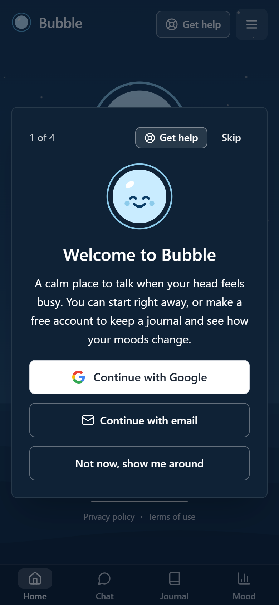
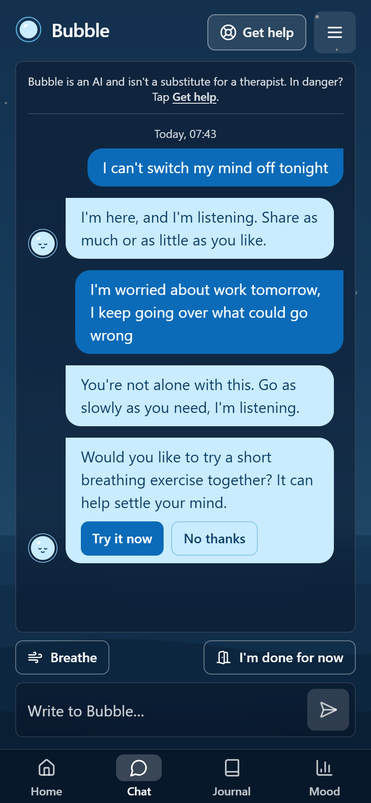
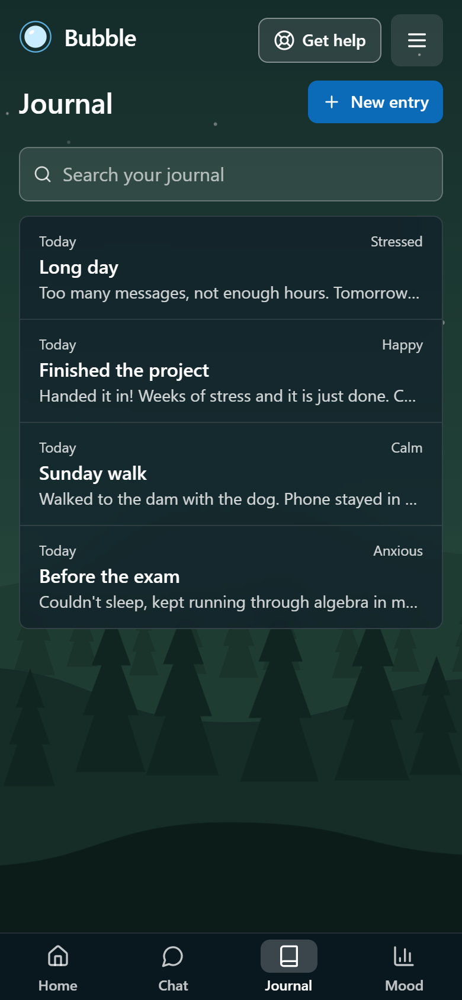
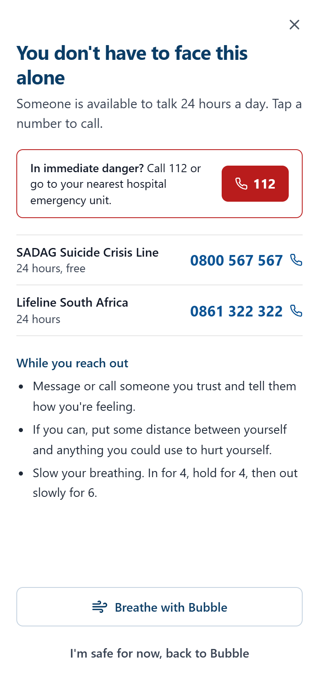
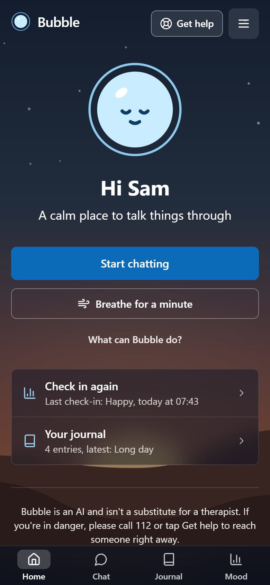
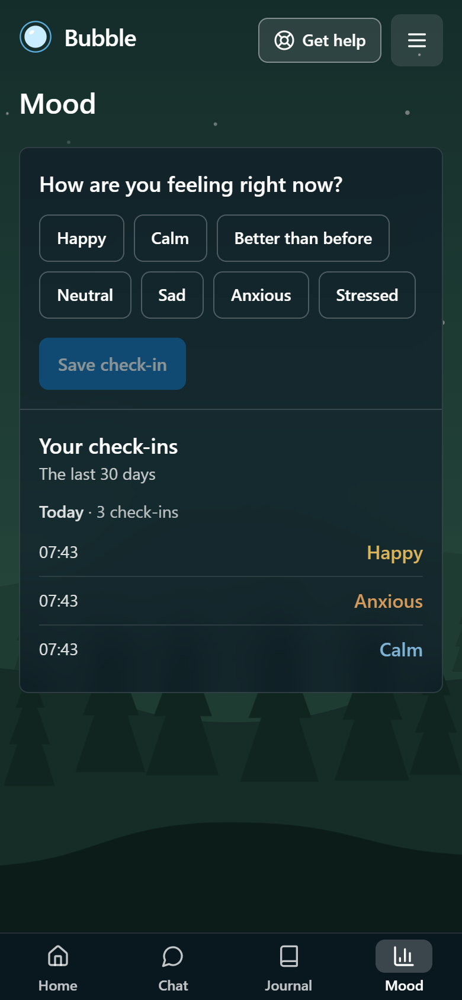
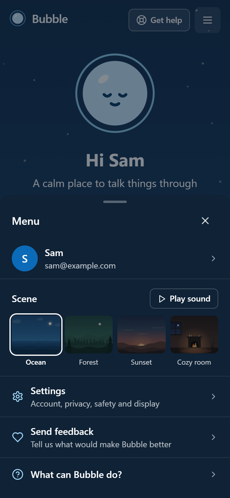
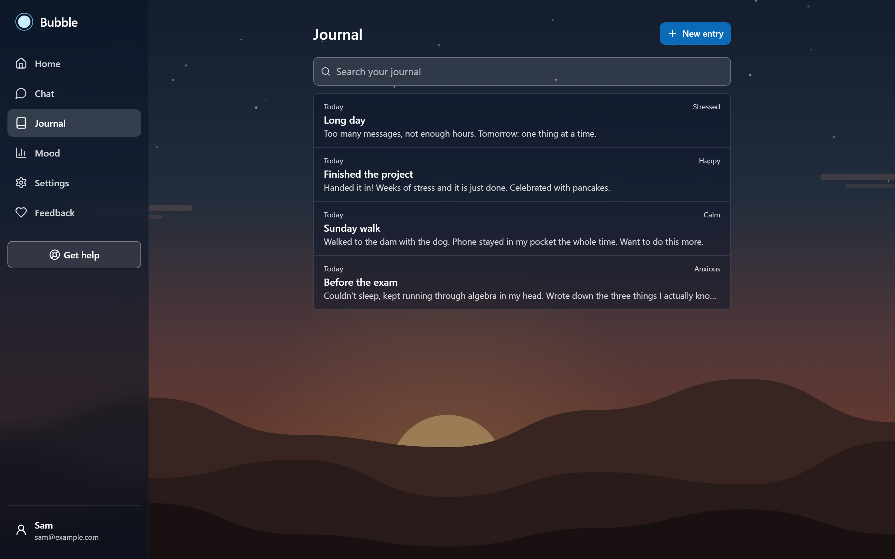
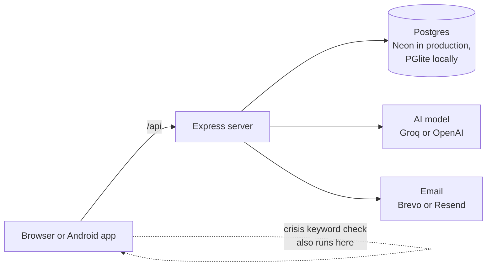

<p align="center">
  
</p>

<p align="center">
  An AI companion for talking things through, with a private journal, mood check-ins,<br>
  a breathing exercise, calming scenes and South African crisis helplines one tap away.
</p>

<p align="center">
  Made together by <a href="https://github.com/Immanah">Immanah Makitla</a> and <a href="https://github.com/andre3oo0">andre3oo0</a>.
</p>

<p align="center">
  <a href="https://bubble-1-kafq.onrender.com"><strong>Open Bubble</strong></a> ·
  <a href="docs/HANDOVER.md">Handover</a> ·
  <a href="docs/SAFETY.md">Safety and privacy</a> ·
  <a href="docs/DEPLOYMENT.md">Deployment</a> ·
  <a href="CONTRIBUTING.md">Contributing</a>
</p>

<p align="center">
  <a href="https://github.com/andre3oo0/Bubble/actions/workflows/ci.yml"></a>
  <a href="https://github.com/andre3oo0/Bubble/releases"></a>
  <a href="https://bubble-1-kafq.onrender.com"></a>
  <a href="LICENSE"></a>
  
  
</p>

<p align="center">
  
  
  
  
  
  
  
</p>

> **Need to talk to someone now?** In South Africa, call the SADAG Suicide Crisis Line on **0800 567 567** (24 hours, free) or Lifeline on **0861 322 322** (24 hours). In an emergency, call **112**. Bubble is an AI and isn't a substitute for a therapist.

## Screenshots

<table>
  <tr>
    <td align="center"><br><sub>Welcome, with optional sign-in</sub></td>
    <td align="center"><br><sub>Chat</sub></td>
    <td align="center"><br><sub>Private journal</sub></td>
    <td align="center"><br><sub>Get help, from every screen</sub></td>
  </tr>
  <tr>
    <td align="center"><br><sub>Home</sub></td>
    <td align="center"><br><sub>Mood check-ins</sub></td>
    <td align="center"><br><sub>Menu and scenes</sub></td>
    <td></td>
  </tr>
</table>

<p align="center">
  
</p>

## What it does

- **Chat with Bubble.** A warm AI companion that listens first, comforts before it advises, and answers honestly when asked. Works without an account.
- **Crisis safety that doesn't depend on the AI.** A keyword check runs on the server and in the browser, so a message about suicide or self-harm always gets the helplines, even when the AI is down, the daily limit is reached, or the phone is offline. The help screen is one tap away on every page.
- **End-of-chat choices.** "I'm done for now" offers to let the conversation go, reflect on it, or save a short reflection to the journal.
- **Private journal.** Writing prompts, search, delete with undo, a warning before unsaved writing is lost, and "Reflect with Bubble" on any entry. Only the person who wrote it can read it.
- **Mood check-ins** with a history of the last 30 days, and the latest one on the home screen.
- **Breathing exercise.** A slow 4-4-6-2 pace, with a longer out-breath.
- **Calming scenes.** Ocean, forest, sunset and a cozy room, drawn in SVG, with ambient sound generated in the browser. Calm visuals turns off movement.
- **Accounts that stay optional.** Email and password or Google. Download or delete everything at any time. A plain-language [privacy policy](https://bubble-1-kafq.onrender.com/privacy) and [terms of use](https://bubble-1-kafq.onrender.com/terms) say what's kept and why.
- **Feedback by email.** The feedback form opens your own email app, so Bubble's server never stores it.
- **Installable.** Works as a PWA with an offline helplines page, and as an Android app.

## How it works



One Node process serves the API and the React app. Chat is stateless apart from a short in-memory context; journal entries, moods and accounts are in Postgres. The AI returns structured replies (reply, mood, risk), and the server's own crisis check always has the last word. More detail, and the reasons behind each decision, is in the [handover](docs/HANDOVER.md).

| Layer | Built with |
|---|---|
| Frontend | React 18, Vite, TypeScript, Tailwind CSS, Radix UI, Zustand, TanStack Query, framer-motion |
| Backend | Node 20+, Express 4, Better Auth |
| Database | Postgres with Drizzle ORM; PGlite (embedded Postgres) locally and in tests |
| AI | OpenAI SDK against Groq's free tier (`qwen/qwen3.8-27b`), or OpenAI |
| Email | Brevo HTTP API, or Resend |
| Tests | Vitest, with an in-memory database and mocked AI and email |
| Hosting | Docker on Render, Neon Postgres, UptimeRobot, GitHub Actions CI |

## Quick start

You need Node.js 20 or newer. No database server is needed locally.

```bash
git clone https://github.com/andre3oo0/Bubble.git
cd Bubble
npm install
cp .env.example .env
npm run dev
```

Open http://localhost:5000. The dev server only accepts connections from your own computer (set `HOST=0.0.0.0` in `.env` to try it from a phone on a network you trust). Without an AI key, chat answers with gentle canned replies and everything else works. For real replies, add a free [Groq](https://console.groq.com/keys) key to `.env`:

```bash
OPENAI_API_KEY=your_groq_key
OPENAI_BASE_URL=https://api.groq.com/openai/v1
OPENAI_MODEL=qwen/qwen3.8-27b
```

The local database lives in `.data/pglite`; delete that folder to start fresh. Migrations run on startup. Every setting is explained in [`.env.example`](.env.example).

## Scripts

| Command | What it does |
|---|---|
| `npm run dev` | Dev server with hot reload (API and frontend on one port) |
| `npm run check` | Type-check the whole project |
| `npm test` | Run the tests (in-memory database, no real services) |
| `npm run build` | Build the frontend and bundle the server into `dist/` |
| `npm start` | Run the production build |
| `npm run try-chat` | Run scripted conversations against the live site (or a URL you pass) and print Bubble's replies |
| `npm run screenshots` | Retake the README screenshots from a local server (uses your installed Chrome) |
| `npm run db:generate` | Create a migration after changing `shared/schema.ts` |
| `npm run db:studio` | Browse the database at `DATABASE_URL` |

## Project layout

```
client/src/
  pages/        Home (the app shell for phone and desktop), ResetPassword, not-found
  components/   Chat, journal, mood, settings, help screen, scenes, intro, menu
  store/        Small Zustand stores (mood, help screen, sound, preferences, account)
  lib/          API calls, auth client, breathing timings, generated sound, moods
client/public/  Manifest, icons, service worker and the offline helplines page
server/         Express app, routes, AI calls, auth, usage limits, email, database
shared/         Database schema, request and response types, crisis safety
migrations/     SQL migrations, applied automatically on startup
scripts/        try-chat, for judging how Bubble talks
docs/           Handover, deployment, safety and privacy, images
```

## Documentation

| Document | For |
|---|---|
| [Handover](docs/HANDOVER.md) | What Bubble is, architecture, decisions and why, gotchas, current state and the work list |
| [Safety and privacy](docs/SAFETY.md) | How crisis handling works, what's stored and what isn't |
| [Deployment](docs/DEPLOYMENT.md) | Running it on the free stack: Render, Neon, Groq, Brevo, Google sign-in, Android |
| [Contributing](CONTRIBUTING.md) | Branches, checks, commit style and the rules every change follows |
| [Security](SECURITY.md) | How to report a vulnerability |

## Who makes Bubble

Bubble is a shared project by [Immanah Makitla](https://github.com/Immanah) and [andre3oo0](https://github.com/andre3oo0). It belongs to both of them: the vision comes from the design document Immanah wrote, and they build the app together. Bubble's earliest history is in [Immanah/BubbleBackend](https://github.com/Immanah/BubbleBackend), where the project started.

## License

[MIT](LICENSE), © 2025-2026 Immanah Makitla and andre3oo0.
